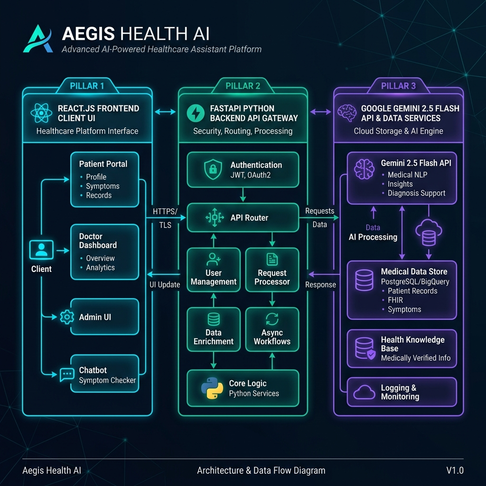
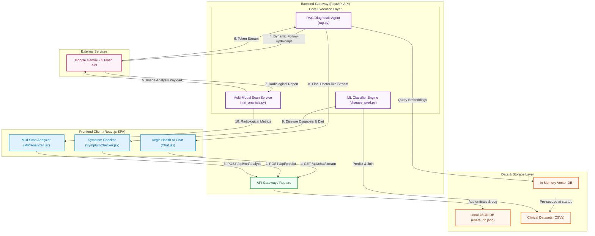

# Aegis Health System Architecture & Data Flow

Below is the complete system architecture and clinical data flow map of the Aegis Health platform, visualizing how requests originate in the React client, route through the FastAPI API gateway, integrate with local datasets and machine learning caches, and utilize Google Gemini multi-modal endpoints for diagnostics and conversation.

---

## 📊 System Flowchart

---

## ⚙️ Architectural Data Flow Breakdown

### 1. Conversational Chat Pathway (RAG)
1. **User Query Input**: The user speaks or types into the Aegis Health AI input on `Chat.jsx`. The message is transmitted via HTTP stream GET request to `/api/chat/stream`.
2. **State & Symptom Extraction**: `rag.py` intercepts the query, parses symptoms using custom alias mapping, and normalizes inputs against the database.
3. **Weak Symptom Follow-Up**: If exactly one symptom is detected, the engine finds related symptoms from the clinical CSVs and streams follow-up choices back to `Chat.jsx`.
4. **Gemini 2.5 flash synthesis**: If multiple symptoms are collected, `rag.py` executes predictions, retrieves precautions and diets from the local clinical database, and formats a compassionate clinical summary via Google Gemini `gemini-2.5-flash` to stream back to the UI.

### 2. Predictive Classification Pathway
1. **Grid Selection**: The patient selects multiple symptom chips in `SymptomChecker.jsx` and clicks **Predict Disease**.
2. **ML Classification**: The backend POST endpoint `/api/predict` passes the vectorized array to the RandomForest Classifier (with Jaccard fallback).
3. **Database Join**: Aegis joins the predicted disease with descriptions, medications, precautions, and dietary recommendations from the CSV datasets.
4. **Structured Results**: Returns structured JSON containing specific diagnosis and health guidelines to map directly onto visual charts and reminders.

### 3. Radiological Scan Pathway
1. **Scan Upload**: The user drops a Brain MRI JPEG/PNG into `MRIAnalyzer.jsx`.
2. **Normalization & Payload**: The image is validated, resized, and encoded.
3. **Multi-Modal Assessment**: `mri_analysis.py` transmits the image directly to Gemini API endpoints.
4. **Diagnostic Metrics**: The API returns anatomical observations, confidence scores, and specialist recommendations, rendering beautiful progress meters and radiology records.
